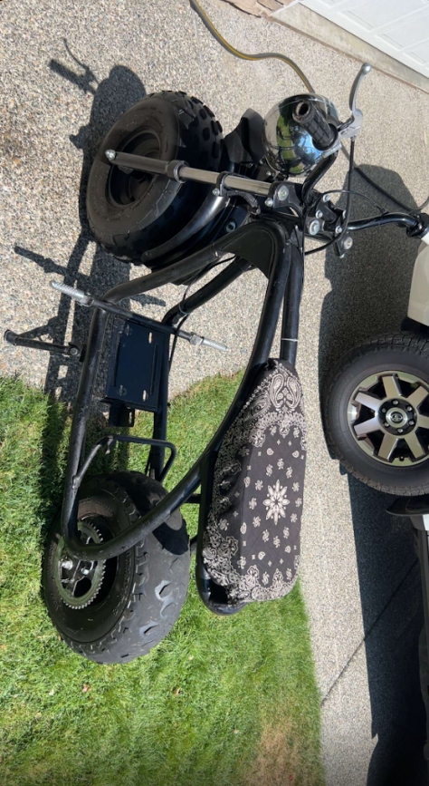
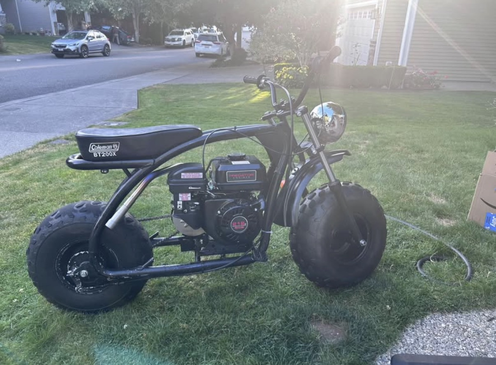
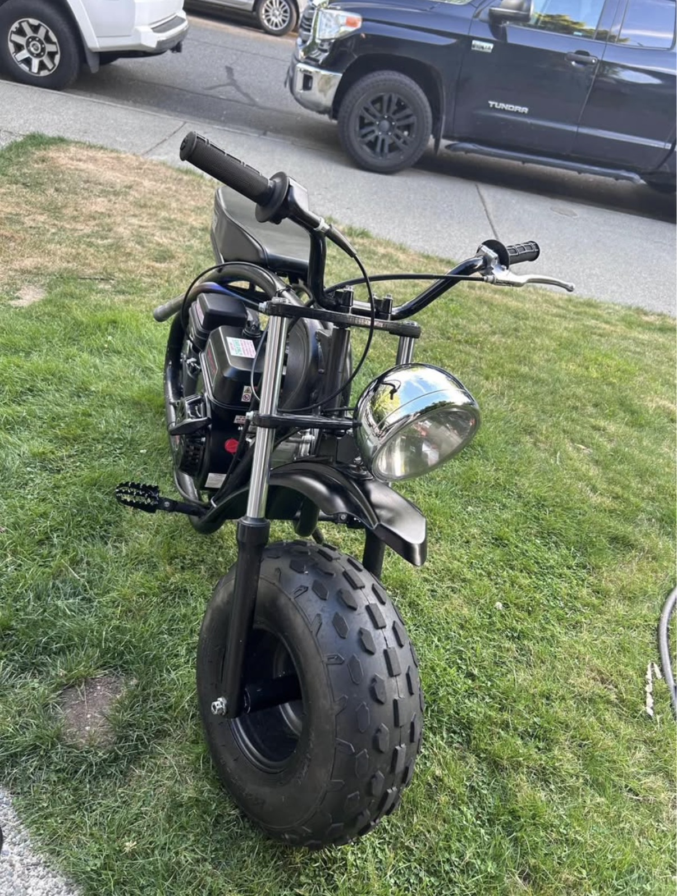

# Build #2 — Predator 212 Torque Converter Minibike

## Project Overview

I bought this minibike as a rolling frame and decided to rebuild it with a Predator 212 engine. I sourced a used Predator 212 from Facebook Marketplace and built the rest of the setup around it.

I did not record every step of this build, but I still had photos from before and after the transformation and remembered the main problems I had to solve during the build.

### Before

*The minibike as I originally bought it before installing the Predator 212 and drivetrain.*

### After

*Completed Predator 212 build after the engine and drivetrain were installed.*

*Another view of the completed bike showing the finished engine installation and overall setup.*

## Engine Setup

After getting the Predator 212, I installed it into the frame and added an aftermarket exhaust to improve exhaust flow. I also installed the throttle/linkage setup needed to connect the hand throttle to the engine.

## Choosing the Drivetrain

From working on other minibikes, I had learned that this type of bike was much larger and heavier than a typical small minibike and also used much larger tires.

I had used centrifugal clutches on smaller bikes before, but for this build I wanted better low-speed acceleration and torque delivery. I decided to use a torque converter as the main drivetrain system instead.

The torque converter gives the drivetrain variable reduction rather than relying on a single fixed clutch ratio, which made more sense for the larger frame and tires.

## Clearance Problem

The biggest problem I ran into was fitment.

When I first installed the torque converter, there was not enough clearance between the drivetrain components and the frame. I needed to change the mounting setup without giving up the torque converter.

I solved the problem in two ways:

1. I cut off an unused section of the torque-converter mounting plate that was interfering with the available space.
2. I bought and installed an engine riser mount to raise the Predator 212 and create additional clearance.

Using both changes together gave me enough room for the engine and torque converter to fit properly in the frame.

## Chain Setup

Once the engine and torque converter were positioned correctly, I measured the chain length needed for the final drivetrain layout.

I cut the chain to the required length, installed it, and checked the drivetrain setup. After everything was assembled, the system operated correctly.

## Problem and Solution

**Problem:** The torque converter did not have enough clearance when installed with the Predator 212 in the original engine position.

**Solution:** I removed an unnecessary section of the torque-converter mounting plate and installed an engine riser. Together, these changes repositioned the drivetrain and provided the clearance needed for the final installation.

This was one of the parts of the build where I had to adjust my original plan after actually installing the components and seeing how they fit together.

## Skills Demonstrated

- Predator 212 engine installation
- Torque-converter drivetrain setup
- Mechanical fitment and clearance troubleshooting
- Engine mounting and repositioning
- Modification of a mounting plate for component clearance
- Chain measurement and sizing
- Drivetrain assembly
- Throttle/linkage installation
- Aftermarket exhaust installation
- Used-component sourcing
- Hands-on troubleshooting and testing
